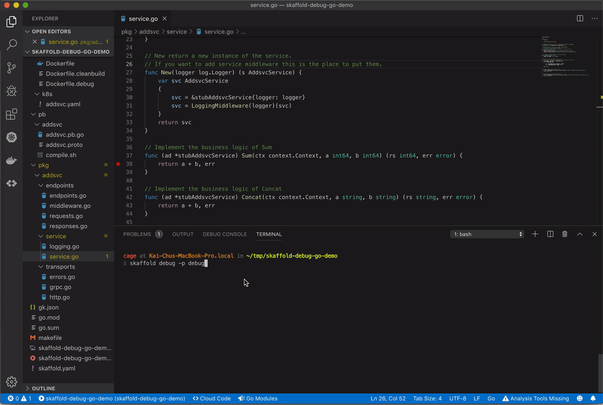

<h1 align="center">Welcome to skaffold debug go demo 👋</h1>
<p>
  <a href="https://github.com/cage1016/skaffold-debug-go-demo/blob/master/LICENSE" target="_blank">
    
  </a>
  <a href="https://twitter.com/CageChung" target="_blank">
    
  </a>
</p>

> demo how to use skaffold remote debug k8s golang microservice

## Blog post

this repo is post [skaffold debug go](https://kaichu.io/2019/10/04/skaffold-debug-goland/) demo sample

## Install

> You need to prepare kubernetes environment fist

```sh
$ git clone git@github.com:cage1016/skaffold-debug-go-demo.git
```

## Usage

#### run skaffold debug profile

```sh
$ skaffold debug -p debug
Listing files to watch...
List generated in 71.108µs
Generating tags...
 - cage1016/skaffold-debug-go-demo-addsvc -> cage1016/skaffold-debug-go-demo-addsvc:latest
Tags generated in 109.42µs
Checking cache...
 - cage1016/skaffold-debug-go-demo-addsvc: Found. Tagging
Cache check complete in 23.601845ms
Tags used in deployment:
 - Since images are not pushed, they can't be referenced by digest
   They are tagged and referenced by a unique ID instead
 - cage1016/skaffold-debug-go-demo-addsvc -> cage1016/skaffold-debug-go-demo-addsvc:88f846061af2d34e8347a6325dcf48bb638f6baa50fd4599240fa5280054048e
Starting deploy...
 - deployment.apps/addsvc created
 - service/addsvc created
Deploy complete in 553.254965ms
Watching for changes...
[addsvc-57b9475fd7-775tm install-go-support] Installing runtime debugging support files in /dbg
[addsvc-57b9475fd7-775tm install-go-support] Installation complete
[addsvc-57b9475fd7-775tm addsvc] API server listening at: 127.0.0.1:56268
[addsvc-57b9475fd7-775tm addsvc] level=info ts=2019-10-03T15:00:28.7135241Z caller=main.go:138 service=addsvc protocol=HTTP exposed=8020
[addsvc-57b9475fd7-775tm addsvc] level=info ts=2019-10-03T15:00:28.7149999Z caller=main.go:151 service=addsvc protocol=GRPC protocol=GRPC exposed=8021
[addsvc-57b9475fd7-775tm install-go-support] <Container was Terminated>
```



## Test

```sh
$ make sum
curl -X "POST" "http://localhost:8020/sum" -H 'Content-Type: application/json; charset=utf-8' -d '{ "a": 3, "b": 34}'
{"rs":37,"err":null}

$ make concat
curl -X "POST" "http://localhost:8020/concat" -H 'Content-Type: application/json; charset=utf-8' -d '{ "a": "3", "b": "34"}'
{"rs":"334","err":null}
```

## Author

👤 **KAI-CHU CHUNG**

* Twitter: [@CageChung](https://twitter.com/CageChung)
* Github: [@cage1016](https://github.com/cage1016)

## 🤝 Contributing

Contributions, issues and feature requests are welcome!<br />Feel free to check [issues page](https://github.com/cage1016/skaffold-debug-go-demo/issues).

## Show your support

Give a ⭐️ if this project helped you!

<a href="https://www.patreon.com/https://kaichu.io">
  
</a>

## 📝 License

Copyright © 2019 [KAI-CHU CHUNG](https://github.com/cage1016).<br />
This project is [MIT](https://github.com/cage1016/skaffold-debug-go-demo/blob/master/LICENSE) licensed.

***
_This README was generated with ❤️ by [readme-md-generator](https://github.com/kefranabg/readme-md-generator)_